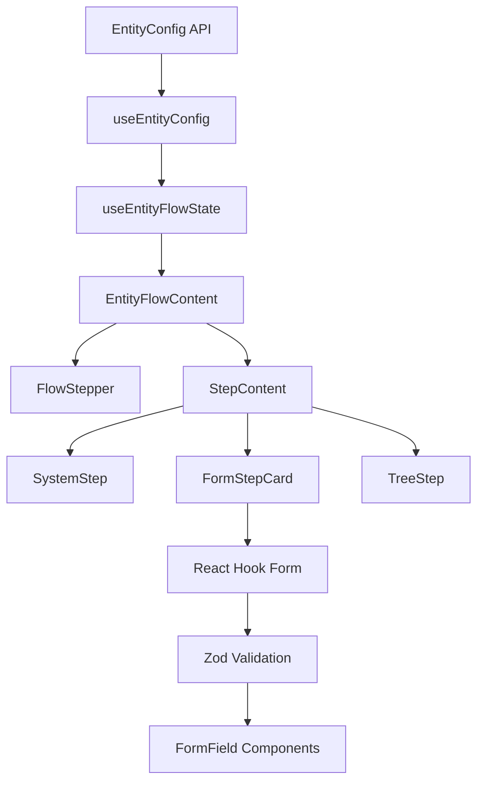

# Entity Creation Drawer - CreateEntityModal

## Overview

This component manages the complete entity creation flow through a multi-step wizard.
Users can select an entity type, configure general properties, set up monitoring (optional),
and choose a location in the hierarchical tree. The UI slides in from the left as a Drawer.

**Tech Stack:**
- **Forms:** React Hook Form + Zod (replaced RJSF in Dec 2024)
- **UI:** Mantine components
- **Validation:** Client-side Zod schemas with type inference

---

## File Structure

```
CreateEntityModal/
├── hooks/
│   ├── index.ts                 # Hook exports
│   ├── useEntityFlowState.ts    # Main composed hook (~290 lines)
│   ├── useEntityConfig.ts       # Config loading (~95 lines)
│   ├── useFlowNavigation.ts     # Flow & step navigation (~140 lines)
│   ├── useSystemSelection.ts    # System selection (~55 lines)
│   └── useFormManager.ts        # Form state management (~367 lines)
├── BindingsStep/                # Step 4: Bindings & Tree Selection
│   ├── BindingsStep.tsx         # Tab container (measurements + bindings)
│   ├── BindingsTab.tsx          # Attachment type manager
│   └── BindingCard.tsx          # Individual binding configuration
├── stepRegistry.ts              # Step configuration registry (~140 lines)
├── StepRenderer.tsx             # Dynamic step renderer (~348 lines)
├── FlowSelector.tsx             # Flow type selector (~75 lines)
├── EntityFlowContent.tsx        # Main content container (~175 lines)
├── CreateEntityModal.tsx        # Modal wrapper
├── FlowStepper.tsx              # Progress stepper UI
├── FormStepCard.tsx             # React Hook Form wrapper (~115 lines)
├── SystemStep.tsx               # System/template selection step
├── SystemSelectionPanel.tsx     # System selection panel with fixed header
├── TreeStep.tsx                 # Tree location selection step
├── DisplayIconMenu.tsx          # Icon picker menu
├── ResultSummary.tsx            # Result summary display
├── entityFormUtils.ts           # Form utility functions
├── iconRegistry.ts              # Icon registry
├── types.ts                     # Type definitions
└── README.md                    # This file

../FormFields/
├── FormField.tsx                # Generic field renderer (~90 lines)
├── LinksField.tsx               # Custom links array field (~77 lines)
└── AsyncSelectField.tsx         # Async select dropdown (~69 lines)

../schemas/
├── formSchemas.ts               # Zod validation schemas (~270 lines)
└── fieldConfigs.ts              # UI field configurations (~280 lines)
```

---

## Flow Types

The system supports three entity types:

| ID | Name | Description |
|----|------|-------------|
| `monitor` | Monitored Entity | Full entity with monitoring configuration |
| `display` | Display Entity | Display-only entity without monitoring |
| `general` | General Entity | Generic entity type |

---

## Step Types

| ID | Name | Description |
|----|------|-------------|
| `system` | System Selection | Choose a template/system from categories |
| `general` | General Details | Form with basic fields (name, type, links, etc.) |
| `monitor` | Monitor Settings | Monitoring configuration for the selected system |
| `tree` | Bindings & Tree | Tabbed step with measurements (tree) and bindings (attachments) |

> **Note:** Not all flows include all steps. For example, the `display` flow skips the `monitor` step.

---

## Architecture

### Hook Composition

The main `useEntityFlowState` hook composes 4 focused sub-hooks:

```
┌─────────────────────────────────────────────────────────────────────┐
│                      useEntityFlowState                             │
│                     (Composer ~290 lines)                           │
├─────────────────────────────────────────────────────────────────────┤
│  useEntityConfig    │ Config loading from API        (~95 lines)   │
│  useFlowNavigation  │ Flow type & step navigation   (~140 lines)   │
│  useSystemSelection │ System/template selection      (~55 lines)   │
│  useFormManager     │ Form data, schemas, submission (~367 lines)  │
└─────────────────────────────────────────────────────────────────────┘
```

### Form Architecture (Post-RJSF Migration)

```
┌───────────────────────────────────────────────────────────────┐
│                  Form System Architecture                      │
├───────────────────────────────────────────────────────────────┤
│                                                                │
│  schemas/formSchemas.ts                                       │
│  ├─ Zod schemas (validation + types)                         │
│  ├─ GeneralFormSchema (Step 2)                               │
│  └─ MonitorSchemaRegistry (Step 3, per system)               │
│                                                                │
│  schemas/fieldConfigs.ts                                      │
│  ├─ UI field configurations (labels, layout, types)          │
│  ├─ GeneralFieldConfig (Step 2)                              │
│  └─ MonitorFieldConfigs (Step 3, per system)                 │
│                                                                │
│  FormFields/                                                   │
│  ├─ FormField.tsx (generic field renderer)                   │
│  ├─ LinksField.tsx (custom array field)                      │
│  └─ AsyncSelectField.tsx (async dropdown)                    │
│                                                                │
│  FormStepCard.tsx                                             │
│  └─ React Hook Form integration                              │
│                                                                │
└───────────────────────────────────────────────────────────────┘
```

### Data Flow



---

## Usage

### Basic Example

```tsx
import { CreateEntityModal } from './components/CreateEntityModal'

function App() {
  const [opened, setOpened] = useState(false)

  return (
    <>
      <Button onClick={() => setOpened(true)}>Create Entity</Button>
      <CreateEntityModal 
        opened={opened} 
        onClose={() => setOpened(false)} 
      />
    </>
  )
}
```

### Direct Hook Access

```tsx
import { useEntityFlowState } from './hooks/useEntityFlowState'

function CustomEntityFlow() {
  const controller = useEntityFlowState()
  
  console.log('Current step:', controller.activeStepKey)
  console.log('Selected system:', controller.selectedSystem)
  console.log('Form data:', controller.currentFormState)
}
```

---

## Adding a New Monitor Form

Adding a new monitor form requires updates in 2 files:

### 1. Add Zod Schema (`schemas/formSchemas.ts`)

```typescript
// Define validation schema
export const MySystemMonitorSchema = z.object({
  serverId: z.string().min(1, 'Server ID is required'),
  port: z.number().int().min(1).max(65535, 'Invalid port'),
  enabled: z.boolean().optional(),
})

// Add to registry
MonitorSchemaRegistry['my_system'] = MySystemMonitorSchema
```

### 2. Add Field Config (`schemas/fieldConfigs.ts`)

```typescript
MonitorFieldConfigs['my_system'] = {
  title: 'My System Monitoring',
  fields: [
    {
      name: 'serverId',
      type: 'text',
      label: 'Server ID',
      colSpan: 6,
      placeholder: 'srv-001'
    },
    {
      name: 'port',
      type: 'number',
      label: 'Port',
      colSpan: 6,
    },
    {
      name: 'enabled',
      type: 'boolean',
      label: 'Enable monitoring',
      colSpan: 12,
    },
  ],
}
```

**That's it!** The form will automatically appear when users select that system.

---

## Modifying Existing Forms

### Changing Validation Rules

Update the Zod schema in `formSchemas.ts`:

```typescript
// BEFORE
dc: z.string().min(1, 'DC is required'),

// AFTER - Add max length
dc: z.string().min(1, 'DC is required').max(10, 'DC too long'),
```

### Changing Field UI

Update the field config in `fieldConfigs.ts`:

```typescript
// BEFORE
{ name: 'dc', type: 'text', label: 'DC', colSpan: 4 }

// AFTER - Change to dropdown
{
  name: 'dc',
  type: 'select',
  label: 'DC',
  colSpan: 4,
  options: [
    { label: 'DC-01', value: 'dc01' },
    { label: 'DC-02', value: 'dc02' },
  ]
}
```

### Adding a New Field

1. Add to schema:
```typescript
newField: z.string().optional(),
```

2. Add to field config:
```typescript
{ name: 'newField', type: 'text', label: 'New Field', colSpan: 6 }
```

---

## Field Types Reference

| Type | Component | Props Required |
|------|-----------|----------------|
| `text` | TextInput | - |
| `textarea` | Textarea | - |
| `number` | NumberInput | - |
| `boolean` | Checkbox | - |
| `select` | Select | `options` array |
| `async-select` | AsyncSelectField | `apiEndpoint` string |
| `links-array` | LinksField | - |

---

## Hook API Reference

### Configuration State

| Field | Type | Description |
|-------|------|-------------|
| `config` | `EntityConfig \| null` | Loaded configuration from API |
| `configStatus` | `'idle' \| 'loading' \| 'error' \| 'success'` | Loading status |
| `configError` | `string \| null` | Error message |
| `handleConfigRetry` | `() => void` | Retry loading |

### Navigation

| Field | Type | Description |
|-------|------|-------------|
| `flow` | `FlowId` | Current flow type |
| `stepKeys` | `StepKey[]` | Steps in the current flow |
| `activeStep` | `number` | Current step index |
| `activeStepKey` | `StepKey \| null` | Current step identifier |
| `isCompleted` | `boolean` | Whether the flow is completed |
| `goToPreviousStep` | `() => void` | Navigate to previous step |
| `handleAdvance` | `() => void` | Advance to next step |

### System Selection

| Field | Type | Description |
|-------|------|-------------|
| `selectedSystem` | `string \| null` | Selected system ID |
| `selectedSystemConfig` | `SystemDefinition \| null` | System configuration |
| `handleSystemSelect` | `(systemId: string) => void` | Select a system |
| `categories` | `CategoryDefinition[]` | Available categories |
| `systems` | `Record<string, SystemDefinition>` | Available systems |

### Forms

| Field | Type | Description |
|-------|------|-------------|
| `currentFormState` | `Record<StepKey, unknown>` | Current form data |
| `formDefinitions` | `FormDefinitionsState` | Loaded form schemas |
| `formStatus` | `FormStatusState` | Form loading status |
| `formErrors` | `FormErrorState` | Form errors |
| `onFormChange` | `Function` | Handle form changes |
| `requestFormDefinition` | `Function` | Load form definition |

### Result

| Field | Type | Description |
|-------|------|-------------|
| `result` | `AggregatedResult \| null` | Final aggregated result |
| `resetFlowState` | `() => void` | Reset all state |

---

## Advanced: Custom Field Components

To create a custom field type:

### 1. Create Component

```tsx
// FormFields/CustomField.tsx
export function CustomField({ value, onChange, ...props }: FieldProps) {
  return (
    <YourCustomComponent
      value={value}
      onChange={onChange}
      {...props}
    />
  )
}
```

### 2. Register in FormField

```tsx
// FormFields/FormField.tsx
case 'custom':
  return <CustomField {...field} control={control} />
```

### 3. Use in Config

```typescript
{
  name: 'myField',
  type: 'custom',
  label: 'My Custom Field',
  colSpan: 12,
}
```

---

## Migration Notes (RJSF → React Hook Form)

**December 2024:** Migrated from RJSF to React Hook Form + Zod

### Benefits
- ✅ **93% smaller** - 3 packages vs 28 packages
- ✅ **Type-safe** - Full TypeScript inference from Zod
- ✅ **Client-side** - No backend dependency for schemas
- ✅ **Maintainable** - Easier to customize and debug
- ✅ **Modern** - Active ecosystem and better DX

### Breaking Changes
- Forms now use Zod instead of JSON Schema
- No more RJSF widgets - use field configs instead
- Validation errors use Zod format

### Compatibility
All existing functionality preserved:
- ✅ Form validation
- ✅ Async select fields
- ✅ Custom links field
- ✅ Multi-step flow
- ✅ Dynamic forms per system

---

## Troubleshooting

### Form not validating
**Check:** Is the field in the Zod schema with proper validation?
```typescript
// Wrong - no validation
myField: z.string()

// Right - with validation  
myField: z.string().min(1, 'Field is required')
```

### Field not showing
**Check:** Is the field in both schema AND field config?
- Schema: `formSchemas.ts` 
- Config: `fieldConfigs.ts`

### Validation message not in Hebrew/English
**Update the Zod schema message:**
```typescript
z.string().min(1, 'הודעה בעברית') // Hebrew
z.string().min(1, 'English message') // English
```

---

## Dependencies

- **react-hook-form** - Form state management
- **@hookform/resolvers** - Zod integration
- **zod** - Schema validation  
- **@mantine/core** - UI library
- **react-icons** - Icons

---

## Backend API

The modal communicates with three endpoints:

1. **GET /config** - Load general configuration (systems, flows, steps)
2. **GET /owning-teams** - Load teams for async select
3. **GET /tree** - Load hierarchical tree nodes

> **Note:** Form schemas are now client-side (no `/form-definition` endpoint needed)

---

## Future Improvements

### Potential Optimizations

1. **Auto-generate field configs from schemas** (~200 lines saved)
   - Use Zod `.describe()` for field metadata
   - Reduce duplication between schemas and configs

2. **Simplify form submission flow** 
   - Flatten the call hierarchy
   - Reduce indirection

3. **Schema-driven field types**
   - Infer `type: 'text'` from `z.string()`
   - Infer `type: 'number'` from `z.number()`
   - Minimal configuration needed

### Considered Features

- **Conditional fields** - Show/hide based on other values
- **Field dependencies** - Validate based on other fields
- **Multi-step validation** - Validate across steps
- **Auto-save drafts** - Persist incomplete forms

---

*Last updated: December 2024 (Added BindingsStep, Layout improvements)*
