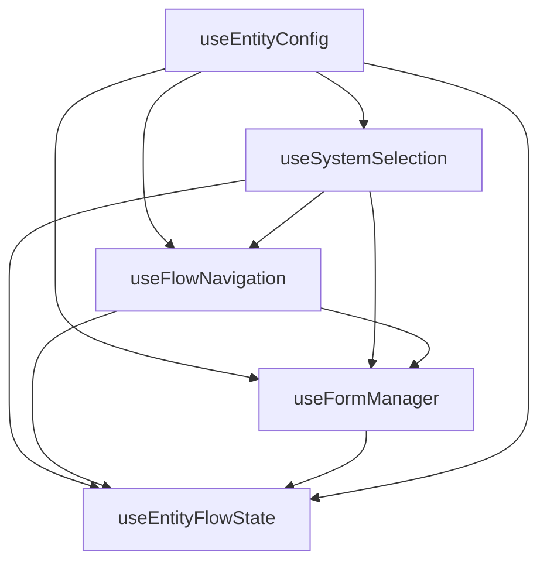
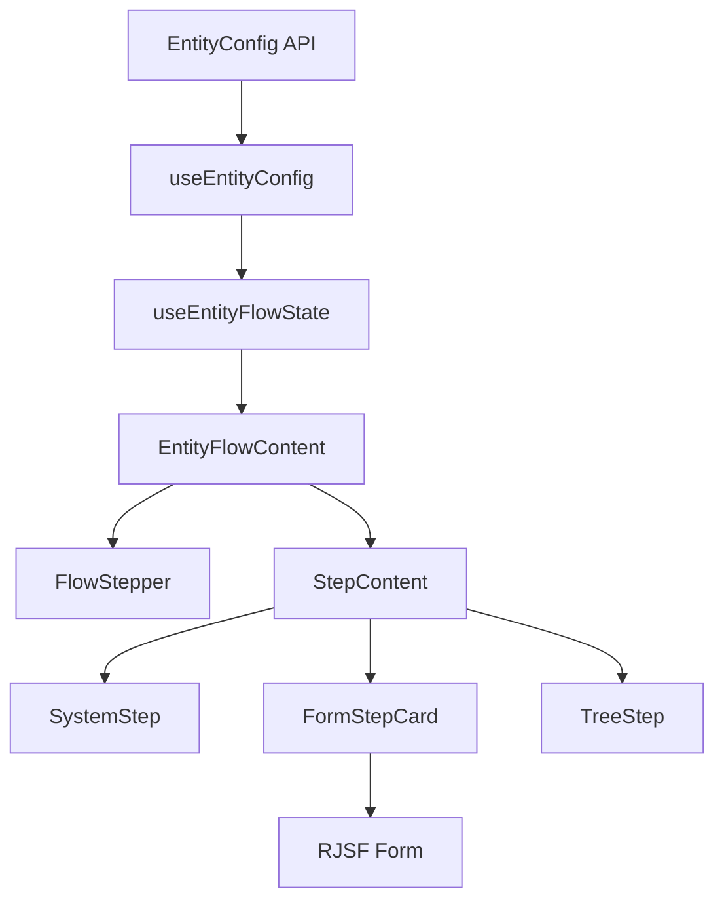

# Entity Creation Modal - CreateEntityModal

## Overview

This component manages the complete entity creation flow through a multi-step wizard.
Users can select an entity type, configure general properties, set up monitoring (optional),
and choose a location in the hierarchical tree.

---

## File Structure

```
CreateEntityModal/
├── hooks/
│   ├── index.ts                 # Hook exports
│   ├── useEntityFlowState.ts    # Main composed hook (~250 lines)
│   ├── useEntityConfig.ts       # Config loading (~95 lines)
│   ├── useFlowNavigation.ts     # Flow & step navigation (~140 lines)
│   ├── useSystemSelection.ts    # System selection (~55 lines)
│   └── useFormManager.ts        # Form state management (~300 lines)
├── stepRegistry.ts              # Step configuration registry (~140 lines)
├── StepRenderer.tsx             # Dynamic step renderer (~310 lines)
├── FlowSelector.tsx             # Flow type selector (~75 lines)
├── EntityFlowContent.tsx        # Main content container (~175 lines)
├── CreateEntityModal.tsx        # Modal wrapper
├── FlowStepper.tsx              # Progress stepper UI
├── FormStepCard.tsx             # RJSF form wrapper
├── SystemStep.tsx               # System/template selection step
├── TreeStep.tsx                 # Tree location selection step
├── SystemSelectionPanel.tsx     # System selection panel
├── DisplayIconMenu.tsx          # Icon picker menu
├── ResultSummary.tsx            # Result summary display
├── entityFormUtils.ts           # Form utility functions
├── iconRegistry.ts              # Icon registry
├── types.ts                     # Type definitions
└── README.md                    # This file
```

---

## Flow Types

The system supports three entity types:

| ID | Name | Description |
|----|------|-------------|
| `monitor` | Monitored Entity | Full entity with monitoring configuration |
| `display` | Display Entity | Display-only entity without monitoring |
| `general` | General Entity | Generic entity type |

---

## Step Types

| ID | Name | Description |
|----|------|-------------|
| `system` | System Selection | Choose a template/system from categories |
| `general` | General Details | Form with basic fields (name, type, links, etc.) |
| `monitor` | Monitor Settings | Monitoring configuration for the selected system |
| `tree` | Tree Location | Hierarchical tree position selection |

> **Note:** Not all flows include all steps. For example, the `display` flow skips the `monitor` step.

---

## Architecture

### Hook Composition

The main `useEntityFlowState` hook composes 4 focused sub-hooks:

```
┌─────────────────────────────────────────────────────────────────────┐
│                      useEntityFlowState                             │
│                     (Composer ~250 lines)                           │
├─────────────────────────────────────────────────────────────────────┤
│  useEntityConfig    │ Config loading from API        (~95 lines)   │
│  useFlowNavigation  │ Flow type & step navigation   (~140 lines)   │
│  useSystemSelection │ System/template selection      (~55 lines)   │
│  useFormManager     │ Form data, schemas, submission (~300 lines)  │
└─────────────────────────────────────────────────────────────────────┘
```

### Sub-Hook Dependencies



### Data Flow



---

## Usage

### Basic Example

```tsx
import { CreateEntityModal } from './components/CreateEntityModal'

function App() {
  const [opened, setOpened] = useState(false)

  return (
    <>
      <Button onClick={() => setOpened(true)}>Create Entity</Button>
      <CreateEntityModal 
        opened={opened} 
        onClose={() => setOpened(false)} 
      />
    </>
  )
}
```

### Direct Hook Access

```tsx
import { useEntityFlowState } from './hooks/useEntityFlowState'

function CustomEntityFlow() {
  const controller = useEntityFlowState()
  
  console.log('Current step:', controller.activeStepKey)
  console.log('Selected system:', controller.selectedSystem)
}
```

---

## Hook API Reference

### Configuration State

| Field | Type | Description |
|-------|------|-------------|
| `config` | `EntityConfig \| null` | Loaded configuration from API |
| `configStatus` | `'idle' \| 'loading' \| 'error' \| 'success'` | Loading status |
| `configError` | `string \| null` | Error message |
| `handleConfigRetry` | `() => void` | Retry loading |

### Navigation

| Field | Type | Description |
|-------|------|-------------|
| `flow` | `FlowId` | Current flow type |
| `stepKeys` | `StepKey[]` | Steps in the current flow |
| `activeStep` | `number` | Current step index |
| `activeStepKey` | `StepKey \| null` | Current step identifier |
| `isCompleted` | `boolean` | Whether the flow is completed |
| `goToPreviousStep` | `() => void` | Navigate to previous step |
| `handleAdvance` | `() => void` | Advance to next step |

### System Selection

| Field | Type | Description |
|-------|------|-------------|
| `selectedSystem` | `string \| null` | Selected system ID |
| `selectedSystemConfig` | `SystemDefinition \| null` | System configuration |
| `handleSystemSelect` | `(systemId: string) => void` | Select a system |
| `categories` | `CategoryDefinition[]` | Available categories |
| `systems` | `Record<string, SystemDefinition>` | Available systems |

### Forms

| Field | Type | Description |
|-------|------|-------------|
| `currentFormState` | `Record<StepKey, unknown>` | Current form data |
| `formDefinitions` | `FormDefinitionsState` | Loaded form schemas |
| `formStatus` | `FormStatusState` | Form loading status |
| `onFormChange` | `Function` | Handle form changes |
| `onFormSubmit` | `Function` | Handle form submission |

### Result

| Field | Type | Description |
|-------|------|-------------|
| `result` | `AggregatedResult \| null` | Final aggregated result |
| `resetFlowState` | `() => void` | Reset all state |

---

## Adding a New Step

To add a new step to the flow:

### 1. Add the Step Key

```typescript
// types/entity.ts
export type StepKey = "system" | "general" | "monitor" | "tree" | "new_step";
```

### 2. Add Step Definition to Config

```json
{
  "steps": {
    "new_step": {
      "label": "New Step",
      "description": "Description of the new step"
    }
  }
}
```

### 3. Add Step to Flow

```json
{
  "flows": {
    "monitor": {
      "steps": ["system", "general", "new_step", "monitor", "tree"]
    }
  }
}
```

### 4. Handle Step in EntityFlowContent

```tsx
// EntityFlowContent.tsx - inside StepContent
if (activeStepKey === 'new_step') {
  return <NewStepComponent {...props} />
}
```

### 5. Update useEntityFlowState (if required)

If the new step requires special handling (e.g., skipping form fetch), update the hook logic.

---

## Future Improvements

1. **Split the Hook** - Break `useEntityFlowState` into smaller focused hooks:
   - `useEntityConfig` - Configuration loading
   - `useFlowController` - Flow management
   - `useStepNavigation` - Step navigation
   - `useFormManager` - Form state management

2. **Step Registry** - Create a dynamic step registry instead of hardcoded definitions

3. **Testing** - Add unit tests for each hook and integration tests

---

## Dependencies

- **@rjsf/core** - Dynamic forms based on JSON Schema
- **@rjsf/mantine** - Mantine theme for RJSF
- **@mantine/core** - UI library
- **react-icons** - Icons

---

## Backend API

The hook communicates with two endpoints:

1. **GET /entity-config** - Load general configuration
2. **GET /form-definition/{systemId}/{stepKey}** - Load form schema

---

*Last updated: December 2024*
